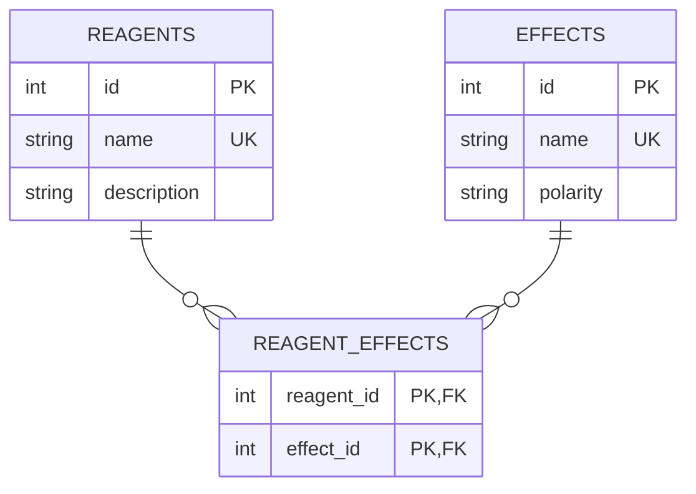

# The Elder Scrolls Alchemy Parser 2.0

The project was originally created as part of a personal role-playing experience in the Elder Scrolls universe with the goal of collecting and normalizing alchemy data (reagents and their effects) from across the series.

## Project Goal

Different Elder Scrolls titles use different names for the same alchemy effects. This made practical use of cross-title alchemy data inconvenient and inefficient in a role-playing setting.

The goal of this project was to collect reagent-effect data from [Unofficial Elder Scrolls Pages (UESP)](https://en.uesp.net/wiki/Lore:Alchemy), identify equivalent effects across games, and bring them under a unified naming scheme while preserving reagent-effect relationships.

For example:

- Restore Health → Health Restoration
- Heal Health → Health Restoration
- Damage Health → Health Damage
- Ravage Health → Health Damage

To support efficient querying and future data use, a decision was made to store the transformed data in a normalized SQLite database. The resulting dataset provides a structured foundation for effect lookup, analysis, and future projects.

This project is built on top of [The Elder Scrolls Alchemy Parser 1.0](https://github.com/ed-cybros/tes-alchemy-parser-v1.0) (first working pipeline) and was further developed as part of a personal learning project.

## Tech Stack


## Core Features

- **Automated Scraping** – Collects reagent names, effects, and descriptions from UESP pages.
- **Effect Standardization** – Maps inconsistent effect names to a single naming scheme.
- **Relationship Preservation** – Maintains reagent-effect relationships throughout the transformation process using an intermediate JSON dictionary structure.
- **Structured Storage** – Stores transformed data in a normalized SQLite database.
- **Data Validation** – Includes validation checks to verify transformation results and database integrity.

## Concepts Applied

- Web scraping with BeautifulSoup
- Data cleaning and normalization
- JSON data processing
- Relational database design
- SQL querying
- Data validation and integrity checks

## Results

- 503 reagents collected.
- 231 unique source effect names identified.
- 222 source effect names covered by the mapping dictionary.
- 104 standardized effect names produced.
- All reagent records preserved during transformation.
- All unmapped effects preserved during transformation.
- No orphan records found in the database.

## Database Schema (ERD)



Many-to-many:

- One reagent may possess multiple effects.
- One effect may be shared by multiple reagents.

The `REAGENT_EFFECTS` junction table stores reagent-effect associations and represents the many-to-many relationship between reagents and effects.

## Folder Structure

```md
project_root/
│ main.py                  # Runs the pipeline
│ README.md
│ data/                    # Stores intermediate and final .json files, mapping dictionary .json
│   ├ 01_alchemy_scraped.json
│   ├ 02_alchemy_transformed.json
│   ├ 03_alchemy_dataset.sqlite
│   └ mapping_dic.json
│ scripts/
│   ├ script1_scrape.py
│   ├ script2_transform.py
│   ├ script3_create_db.py
│   └ script4_insert_data.py
│ notebooks/
│   └ tes_alchemy_parser_2.0_overview.ipynb
```

## Requirements

- Python 3.x
- requests
- beautifulsoup4

## Install dependencies

`pip install requests beautifulsoup4`

## How To Run

Run main entry point to execute the full pipeline:

```bash

python main.py

```

## Notes

- Ensure `data/` folder exists before running the scripts.
- Intermediate files and the final dataset are stored in `data/`.
- Update the mapping dictionary if new effect names are introduced.
- Update `skip_headings` if UESP introduces additional non-reagent sections.

## Notebook Overview

The accompanying notebook contains:

- Pipeline architecture overview
- Database schema and ERD
- Data transformation workflow
- Data integrity validation
- Example SQL and Pandas lookups
- Project results and conclusions

See:

[tes_alchemy_parser_2.0_overview](notebooks/tes_alchemy_parser_2.0_overview.ipynb).

## Disclaimer

This project was created primarily as a personal learning project and is not actively maintained. Future additions or changes to UESP pages may require updates to the scraping and normalization logic.
